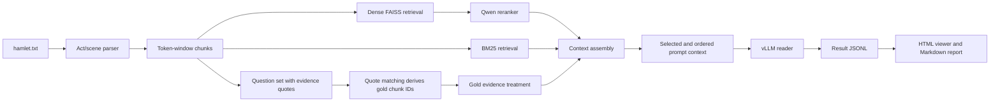

# Hamlet QA Failure Analysis

## Overview

This module is a qualitative failure-analysis harness for long-document question answering over one document: `hamlet.txt`. It is designed to make retrieval-augmented generation (RAG) behavior inspectable. The code splits Hamlet into stable act/scene chunks, validates a small question set with required evidence quotes, derives gold chunk IDs by quote matching, runs several retrieval and context-ordering treatments, and renders the resulting prompts, chunks, retrieval scores, evidence recall, and model outputs for manual inspection.

The main research question behind this repo is:

> Given a fixed context budget, what evidence does a RAG system actually place in front of the generator, and how do retrieval, budget, and ordering choices affect the answer?

## Setup

The project is configured for Python `3.12.3`, as recorded in `.python-version`. The conda environment in `environment.yml` uses Python `3.12`. The intended pip workflow is `python -m pip` inside the activated environment; the setup script upgrades pip before installing dependencies. The development target is Python `3.12.3` with pip `25.3` or a compatible recent pip release.

Recommended setup on a research server:

```bash
bash setup.sh
source "$(conda info --base)/etc/profile.d/conda.sh"
conda activate hamlet-qa
python --version
python -m pip --version
```

Manual setup with an existing Python 3.12 installation:

```bash
python3.12 -m venv venv
source venv/bin/activate
python -m pip install --upgrade pip
pip install -r requirements.txt
```

The repository includes:

- `requirements.txt`: Python dependencies for the experiment pipeline.
- `environment.yml`: conda environment name and Python version.
- `setup.sh`: server-oriented helper that creates a conda environment when possible and falls back to `venv/` only if `python3.12` is available.

The full generation run requires a machine that can serve the configured reader model with vLLM. Unit tests and prompt-preparation runs do not require reader-model inference. If the PyPI `vllm` package does not match the CUDA/PyTorch setup on your server, install a compatible vLLM wheel for that machine before running generation.

Run the tests with:

```bash
python -m unittest discover -s tests
```

Optional smoke test without vLLM generation:

```bash
python -m hamlet_qa.run_experiment \
  --run-name dry_prompts \
  --prepare-only \
  --treatments closed_book
```

## Codebase Structure

```text
rag-analysis/
    - README.md
    - requirements.txt
    - pyproject.toml
    - environment.yml
    - setup.sh
    - .python-version
    - hamlet.txt
    - data/
        -- hamlet_chunks.jsonl
        -- hamlet_questions.json
    - hamlet_qa/
        -- __init__.py
        -- build_chunks.py
        -- chunking.py
        -- config.py
        -- experiment.py
        -- generation.py
        -- inspect_results.py
        -- io_utils.py
        -- prompts.py
        -- questions.py
        -- read_results.py
        -- report.py
        -- results_html.py
        -- retrieval.py
        -- run_experiment.py
    - runs/
        -- <run_name>/
            --- results.jsonl
            --- run_config.json
            --- hamlet_chunks.jsonl
            --- hamlet_questions_input.json
            --- hamlet_questions_resolved.json
    - tests/
        -- test_chunking.py
        -- test_config.py
        -- test_experiment.py
        -- test_hygiene.py
        -- test_questions.py
        -- test_report.py
        -- test_results_html.py
        -- test_retrieval.py
```

Important files and components:

- `hamlet_qa/chunking.py`: parses act/scene boundaries and creates token-window chunks.
- `hamlet_qa/questions.py`: loads questions, normalizes evidence quotes, and derives gold chunk IDs by quote matching.
- `hamlet_qa/retrieval.py`: implements dense FAISS retrieval, Qwen reranking, and BM25 retrieval.
- `hamlet_qa/experiment.py`: assembles treatments, applies context budgets, builds prompts, runs the reader, and writes result rows.
- `hamlet_qa/generation.py`: wraps vLLM reader-model inference.
- `hamlet_qa/results_html.py`: renders an interactive standalone HTML result viewer.
- `hamlet_qa/report.py`: renders a compact Markdown inspection report.
- `data/hamlet_questions.json`: editable question set with expected answers and required evidence quotes.
- `data/hamlet_chunks.jsonl`: generated default chunk file.
- `runs/<run_name>/`: reproducibility artifacts for an experiment run.
- `tests/`: unit tests for chunking, retrieval, question validation, experiment assembly, reporting, and hygiene.

## Functional Design (Usage)

Most users should use the command-line entry points. The importable functions are useful if you want to script custom runs or inspect intermediate objects.

Build the default Hamlet chunk file:

```bash
python -m hamlet_qa.build_chunks \
  --document hamlet.txt \
  --output data/hamlet_chunks.jsonl
```

Run the default experiment:

```bash
python -m hamlet_qa.run_experiment \
  --run-name qwen_hamlet_probe
```

Render the interactive HTML viewer:

```bash
python -m hamlet_qa.results_html \
  runs/qwen_hamlet_probe/results.jsonl \
  --output runs/qwen_hamlet_probe/results_viewer.html
```

Render a Markdown inspection report:

```bash
python -m hamlet_qa.inspect_results \
  --results runs/qwen_hamlet_probe/results.jsonl \
  --output runs/qwen_hamlet_probe/inspection.md
```

Programmatic experiment entry point:

```python
from pathlib import Path

from hamlet_qa.config import RunConfig
from hamlet_qa.experiment import run_experiment

config = RunConfig(
    run_name="dry_prompts",
    prepare_only=True,
    treatments=["closed_book"],
)

results_path: Path = run_experiment(config)
```

Public functions and classes most relevant to users:

```python
from hamlet_qa.chunking import build_chunks, load_tokenizer, write_chunks

tokenizer = load_tokenizer("Qwen/Qwen3.5-9B")
chunks = build_chunks(
    document_path="hamlet.txt",
    tokenizer=tokenizer,
    chunk_size=256,
    chunk_overlap=64,
)
write_chunks("data/hamlet_chunks.jsonl", chunks)
```

```python
from hamlet_qa.questions import load_questions, validate_questions
from hamlet_qa.io_utils import load_jsonl

questions = load_questions("data/hamlet_questions.json")
chunks = load_jsonl("data/hamlet_chunks.jsonl")
validate_questions(questions, chunks)
```

```python
from hamlet_qa.retrieval import BM25Retriever

retriever = BM25Retriever(chunks)
hits = retriever.retrieve("Who says that it is bitter cold?", top_k=10)
```

```python
from hamlet_qa.results_html import write_results_html
from hamlet_qa.report import write_inspection_report

write_results_html(
    "runs/qwen_hamlet_probe/results.jsonl",
    "runs/qwen_hamlet_probe/results_viewer.html",
)
write_inspection_report(
    "runs/qwen_hamlet_probe/results.jsonl",
    "runs/qwen_hamlet_probe/inspection.md",
)
```

## Demo Video

[Google Drive Link](https://drive.google.com/drive/folders/1Ty-7_uF6VIguJL_L8Qjo9Hy28sjdwu1Z?usp=sharing)

## Algorithmic Design

The module studies a standard RAG pipeline, but its focus is the context assembly step between retrieval and generation.



The document is first parsed into act/scene records. Each scene is split into overlapping token windows using the configured tokenizer. Questions contain expected answers and required evidence quotes. During validation, the code normalizes each quote and finds the chunk IDs that contain it. These derived IDs act as gold evidence for recall measurement and gold-evidence treatments.

The experiment runner evaluates multiple treatments:

- `closed_book`: asks the reader without retrieved context.
- `gold_evidence`: supplies chunks derived from required evidence quotes.
- `dense_reranked`: embeds chunks, searches with FAISS, and reranks candidates.
- `dense_document_order`: uses the same dense-selected chunks but orders them by original document position.
- `dense_random_order`: uses the same dense-selected chunks but applies a deterministic random order.
- `sparse_bm25`: retrieves chunks with lexical BM25 scoring.

The context budget is applied after candidate ranking. Chunks are added until the configured context-token budget is reached. Each result row records selected chunks, prompt order, retrieval trace, retrieval scores, evidence chunk recall, evidence quote recall, prompt text, model output, and run configuration.

The current default configuration uses:

- reader model: `Qwen/Qwen3.5-9B`
- embedding model: `Qwen/Qwen3-Embedding-8B`
- reranker model: `Qwen/Qwen3-Reranker-8B`
- chunk size: `256` tokens
- chunk overlap: `64` tokens
- context budget: `1000` context tokens
- random seed: `13`

## Issues and Future Work

- The repo is Hamlet-specific; it is not yet a general long-document QA framework.
- The question set is intentionally small and qualitative, so results should not be treated as statistically robust benchmark claims.
- Current chunking uses simple overlapping token windows within scenes. Future chunking should use speaker-turn-aware chunks with a hard max token cutoff.
- Budgeted `gold_evidence` is not a perfect oracle when all required evidence cannot fit under the context budget.
- Evidence quote recall measures whether required quote chunks are present, but it does not yet measure evidence-role recall such as `plan`, `staged_evidence`, and `reaction_confirmation`.
- Ordering ablations are most interpretable only after evidence presence is controlled.
- Dense retrieval and generation depend on large model downloads and GPU/server availability.
- Future work should compare redundancy-aware selection, MMR, scene diversity, role diversity, neighbor expansion, and larger public-domain documents.

## Change Log

Spring 2026 (Yifan Luo)

- Built the Hamlet qualitative failure-analysis harness after larger long-document QA benchmark experiments raised context assembly questions.
- Added act/scene chunking with stable chunk IDs.
- Added editable Hamlet question data with required evidence quotes.
- Added quote matching to derive gold chunk IDs automatically.
- Added closed-book, gold-evidence, dense, ordering, and BM25 treatments.
- Added Qwen3.5 reader, Qwen3 embedding, and Qwen3 reranker defaults.
- Added result JSONL logging with prompt text, selected chunks, retrieval scores, quote recall, and run configuration.
- Added standalone HTML result viewer and Markdown inspection report.
- Added unit tests for chunking, retrieval, questions, experiment assembly, reporting, and repository hygiene.

## References

- Dataset/source text: Project Gutenberg, *Hamlet by William Shakespeare*: https://www.gutenberg.org/ebooks/1122
- Qwen3.5-9B model card: https://huggingface.co/Qwen/Qwen3.5-9B
- Qwen3-Embedding-8B model card: https://huggingface.co/Qwen/Qwen3-Embedding-8B
- Qwen3-Reranker-8B model card: https://huggingface.co/Qwen/Qwen3-Reranker-8B
- vLLM documentation: https://docs.vllm.ai/
- Sentence Transformers documentation: https://www.sbert.net/
- FAISS documentation: https://faiss.ai/
